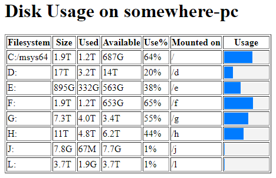

# View the output of `df` in the browser

Re: [this post](https://old.reddit.com/r/selfhosted/comments/1dgyvht/simple_app_to_graphically_show_how_full_my_hard/) on /r/Selfhosted.

This script generates an HTML file that displays disk usage information using the ubiquitous `df` command. For info, type `df --help` or `man df`. 



## Setup as a Cron Job

1. Open the crontab file for editing by running `crontab -e`.

2. Add a new line to schedule the script to run at your desired frequency. For example, to run the script every hour, you would add:

```cron
0 * * * * /path/to/your/webdf.sh
```

3. Save and close the crontab file. The new cron job will start running at the next scheduled time.

## Setup as a Systemd Timer/Unit
Or, as (better) alternative:

1. Create a new service file at `/etc/systemd/system/disk-usage.service` with the following content:

```ini
[Unit]
Description=Generate disk usage report

[Service]
ExecStart=/path/to/your/webdf.sh
```

2. Create a new timer file at `/etc/systemd/system/disk-usage.timer` with the following content:

```ini
[Unit]
Description=Run disk usage report hourly

[Timer]
OnCalendar=hourly
Persistent=true

[Install]
WantedBy=timers.target
```

3. Enable and start the timer:

```shell
sudo systemctl enable disk-usage.timer
sudo systemctl start disk-usage.timer
```

## Serve the page
Serve the generated `disk_usage.html` file with your web server. In `nginx` (which I tell everyone to use), this can be done as simply as adding the following `location` block to an existing site config:

```nginx
location /df/ {
        alias /mnt/c/code/shell/webdf/;
        try_files disk_usage.html =403;
        expires 3600s;
}
```

